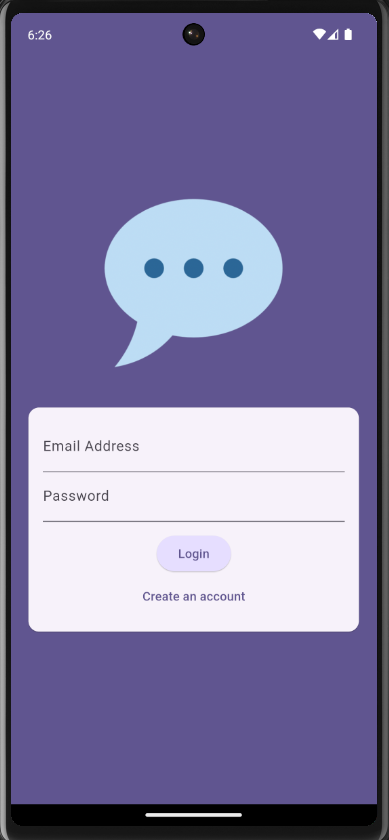
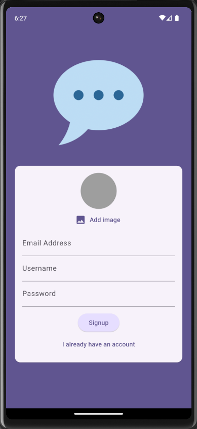
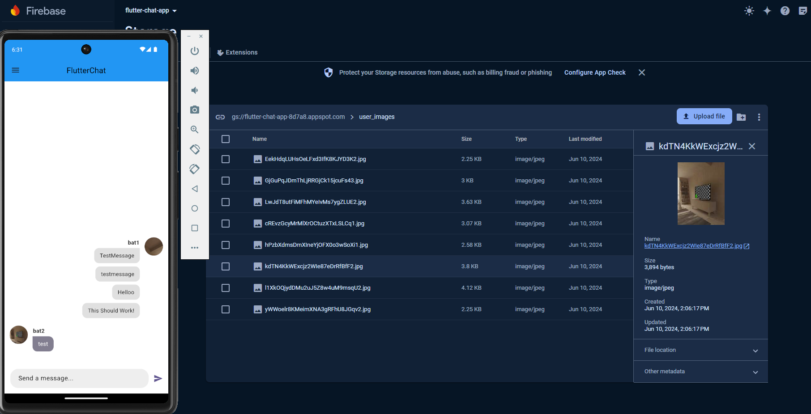
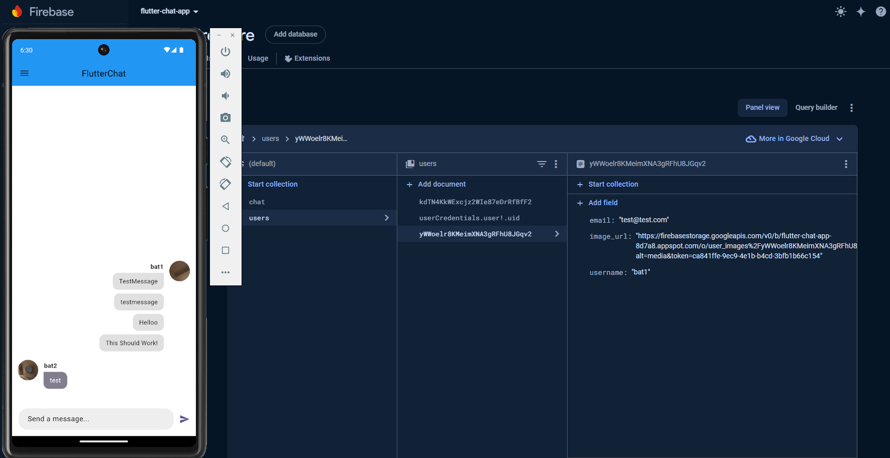
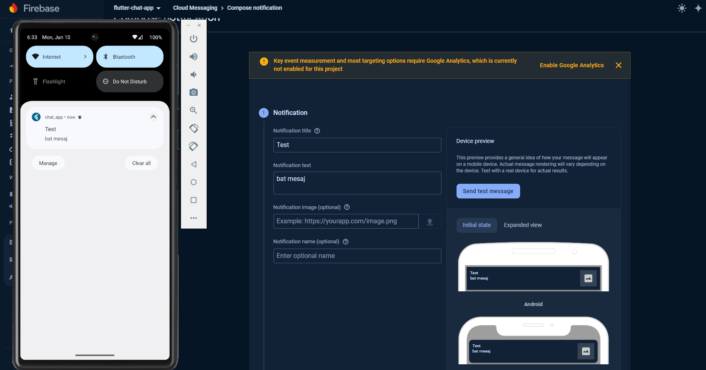

# chat_app

    Bu proje, Firebase kullanılarak, 2 veya daha fazla kullanıcının birbirleri ile mesajlaşabildiği, 
    her kullanıcının bir hesap oluşturduğu ve fotoğraf eklediği bir uygulamadır. 

---

# Ekran Görüntüleri
#### Login Sayfası

---
#### Kayıt Sayfası

---
#### Chat Ekranı

---
#### Koyu Temalı Chat Ekranı

---
#### Firebase Üzerinde Mesajların Konumu

---
#### Firebase Üzerinde Profil Fotoğraflarının Bulunduğu Konum

---
#### Firebase Üzerinde Kullanıcıların Saklandığı Konum

---
#### Uygulamaya Bildirim Gönderimi

---

# Takım Üyeleri
- Mustafa Batuhan Yeşilkaya / 229920529 /  İleri Mobil Programlama

# Ders Adı
### İleri Mobil Programlama

# Supervisor
### Keyvan Arasteh Abbasabad